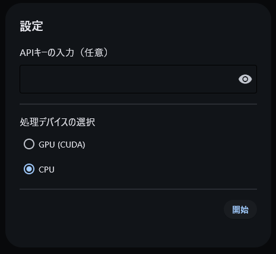
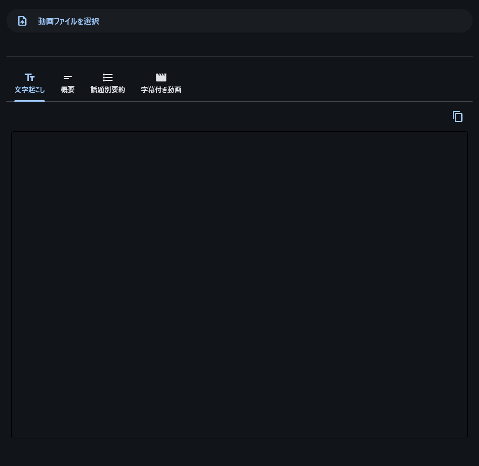
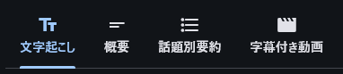

# Whisper音声認識とクラウドベースGemini AIを統合した動画コンテンツ自動文字起こし・要約システム セットアップガイド

## 目次

1. [基本環境のセットアップ](#1-基本環境のセットアップ)
2. [Python環境のセットアップ](#2-python環境のセットアップ)
3. [フォルダのセットアップ](#3-フォルダのセットアップ)
4. [アプリケーションの実行](#4-アプリケーションの実行)
5. [実行ファイルの作成](#5-実行ファイルの作成)
6. [実行方法ガイド](#6-実行方法ガイド)
7. [注意事項](#7-注意事項)

## 1. 基本環境のセットアップ

### VSCodeのインストール

1. [VSCode公式サイト](https://code.visualstudio.com/)にアクセス
2. 「Download for Windows」をクリック
3. ダウンロードしたインストーラーを実行
4. デフォルト設定のままインストール

### Minicondaのインストール

1. [Miniconda公式サイト](https://docs.anaconda.com/miniconda/)にアクセス
2. 「Miniconda3 Windows 64-bit」をダウンロード
3. インストーラーを実行
4. インストール時の重要なオプション：
   - 「Add Miniconda3 to my PATH environment variable」にチェック
   - 「Register Miniconda3 as my default Python environment」にチェック

### Gemini APIキーの取得

1. [Google AI Studio](https://makersuite.google.com/app/apikeys)にアクセス
2. Googleアカウントでログイン
3. 「APIキーの作成」をクリック
4. 生成されたAPIキーをコピーして安全に保存します、プログラム実行時に使います

### CUDA Toolkitのセットアップ（オプション - 処理速度向上）

**注意**: この手順は、NVIDIA GPUをお持ちの方のみ対象です。セットアップが複雑な場合は省略可能ですが、その場合CPUでの実行となり、文字起こしの処理速度が遅くなります。

1. [CUDA Toolkit公式サイト](https://developer.nvidia.com/cuda-11-8-0-download-archive?target_os=Windows)にアクセス
2. お使いのWindowsバージョンに合わせたCUDA Toolkitをダウンロード
3. インストーラーを実行（デフォルト設定推奨）
4. [cuDNN公式サイト](https://developer.nvidia.com/rdp/cudnn-archive)にアクセス
5. 「Download cuDNN v8.9.7 (December 5th, 2023), for CUDA 11.x」をクリックしてcuda11.8に対応したcuDNNをダウンロード
6. 解凍したcuDNNの中身をすべて次のフォルダに移す
```
C:\Program Files\NVIDIA GPU Computing Toolkit\CUDA\v11.8\bin
```
7. コマンドプロンプトで以下のコマンドを実行して確認：
```bash
nvcc --version
```

**補足**: CUDAのセットアップが成功しない場合は、[こちらのブログ](https://note.com/hcanadli12345/n/nb8cf59ca2596)（※外部サイト）が参考になるかもしれません。

## 2. Python環境のセットアップ

### コマンドプロンプトを管理者として実行

1. Windowsキー + Rを押して「実行」ダイアログを開く
2. `cmd`と入力
3. Ctrl + Shift + Enterを押して管理者として実行

### Python仮想環境の作成

1. 以下のコマンドを実行して、Python 3.10.14の仮想環境を作成：
```bash
conda create -n video_transcribe python=3.10.14 -y
```

2. 作成した仮想環境を有効化：
```bash
conda activate video_transcribe
```

### 必要なパッケージのインストール

以下のコマンドを順番に実行して、必要なパッケージをインストール：

```bash
pip install flet==0.25.1
pip install flet_video
pip install faster-whisper
pip install google-generativeai
pip install moviepy==1.0.3
```

もしくは下のフォルダのセットアップをした後に

```bash
cd VideoTranscribe
pip install -r requirements.txt
```

## 3. フォルダのセットアップ

1. VideoTranscribe.zipを解凍
2. 展開したフォルダ内の構成を確認：
   - `src/` - ソースコードフォルダ
   - `iamges/` - ガイド用の画像フォルダ
   - `README.md` - セットアップ用のガイド
   - `requirements.txt` - 必要なパッケージリスト
   - `run.bat` - アプリケーション実行用batファイル
   - `main.exe` - アプリケーション実行用exeファイル


## 4. アプリケーションの実行

### VSCodeでプロジェクトを開く

1. VSCodeを起動
2. 「ファイル」→「フォルダを開く」でVideoTranscribeフォルダを選択

### Python環境の選択

1. VSCode右下の「Python環境を選択」をクリック
2. `video_transcribe`環境を選択

### アプリケーションの実行方法

#### 方法1: VSCode内から実行
1. `src/main.py`を開く
2. 右上の再生ボタンをクリック

#### 方法2: ターミナルから実行
```bash
conda activate video_transcribe
python src/main.py
```

#### 方法3: バッチファイルから実行
付属の`run.bat`をダブルクリックで実行できます。このファイルには方法2と同じコマンドが記述されています。

#### 方法4: .exeファイルを実行
付属の`main.exe`をダブルクリックで実行できます。

## 5. 実行ファイルの作成
flet packコマンドを使ってワンファイル化します。実行後は`dist`フォルダ内に`main.exe`が作られます。
```bash
conda activate video_transcribe
pip install pyinstaller
flet pack src/main.py
```

## 6. 実行方法ガイド

【初回起動時の注意事項】

初回起動時には以下の2点が必要となります：

1. インターネット接続
   - 音声認識エンジン(faster-whisper)のモデルデータをダウンロードするため

2. 管理者権限での実行
   - モデルデータをシステムフォルダにインストールするため
   - 2回目以降は通常の権限で実行可能です

※モデルのダウンロードは初回のみで、以降の起動時は不要です。

### 起動画面


1. アプリケーション起動時に設定画面が表示されます
   - APIキー入力（オプション）: Gemini APIキーを入力、ここで何も入力をしない事で完全にローカル上で完結できます
   - 処理デバイスの選択: GPU(CUDA)またはCPU

### メイン画面


1. 「動画ファイルを選択」をクリック
2. 対応する動画ファイルを選択
3. 処理の進捗状況が表示されます

### 機能タブ


- 文字起こし: タイムスタンプ付きの文字起こし結果
- 概要: 動画の要約（APIキー必要）
- 話題別要約: トピックごとの要約（APIキー必要）
- 字幕付き動画: 字幕付きで動画を再生

## 7. 注意事項

- Whisperモデルの初回実行時は、モデルのダウンロードが必要なため時間がかかります
- GPUを使用する場合、処理速度が高速になります
- 動画ファイルは以下の形式に対応しています：
  - `.mp4`
  - `.avi`
  - `.mov`
  - `.mkv`
